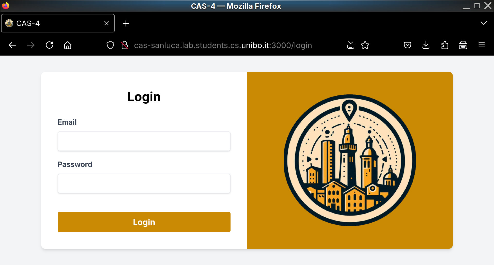

# CAS4 network


This repository refers to the network of the CAS-4 project of this organisation.
The following networking setup is a Kubernetes application which uses KubeEdge
to run some an application on simulated bare nodes.

This represents a orchestration of:

- [`cas-4/backend`](https://github.com/cas-4/backend)
- [`cas-4/frontend`](https://github.com/cas-4/frontend)

## Set up

You can run Kubernetes via Minikube or something else. For this project we
used KinD. If you install KinD do not forget to also install a Load Balancer for
Kubernetes: [Cloud Provider
KinD](https://kind.sigs.k8s.io/docs/user/loadbalancer/) is what we used.

Now, you can proceed to set up some environment variables:

- `JWT_SECRET`: the base64 version of the secret used for JWT tokens.
- `EXPO_ACCESS_TOKEN`: the base64 version of the [Expo](https://expo.dev) access token.
- `UNREALSPEECH_TOKEN`: [Unrealspeech](https://unrealspeech.com/) access token.
- `RUST_LOG`: level of Rust logging (info, debug, ...).
- `VITE_API_URL`: url for the backend API.

Meanwhile the followings are setted up by default.

- `ALLOWED_HOST`: "0.0.0.0:8000"

First of all you must create a new cluster for KinD. We need it for some worker
(let's say 4).

```
$ kind create cluster --config yaml/cluster/kind-cluster-config.yaml
```

You also need to install a component for metrics.
```
$ kubectl apply -f https://github.com/kubernetes-sigs/metrics-server/releases/latest/download/components.yaml
```

After that just run the `run.sh` script.

```sh
$ ./run.sh apply
```

After that, you'll be able to see what the external IP for the load balancer is.

```
$ k get svc
NAME                   TYPE           CLUSTER-IP      EXTERNAL-IP   PORT(S)        AGE
cas-backend-service    LoadBalancer   10.96.107.232   172.18.0.3    80:32697/TCP   18h
cas-frontend-service   NodePort       10.96.49.130    <none>        80/TCP         18h
postgres-service       ClusterIP      10.96.150.101   <none>        5432/TCP       18h
```

For the IP above you can test if it works by a HTTP request.

```
$ curl -X POST http://172.18.0.3/graphql \
-H "Content-Type: application/json" \
-d '{
  "query": "mutation Login($input: LoginCredentials!) { login(input: $input) { accessToken tokenType userId } }",
  "variables": {
    "input": {
      "email": "info@cas-4.github",
      "password": "mysuperpassword"
    }
  }
}'
```

If you receive a network error you just need to wait until the
`cloud-provider-kind` works.

## Deploy on production

We tested this project in production using Nginx as revere proxy. Indeed, at the
endpoint `server_name` an user could access to the frontend project (i.e. admin
cp).

We chose [Kubeadm](https://kubernetes.io/docs/reference/setup-tools/kubeadm/) and [Cilium](https://cilium.io/use-cases/load-balancer/) as Load Balancer.

Also, you need to set up Nginx server as reverse proxy.

```
$ frontend_ip=`k get svc cas-frontend-service -ojson | jq .spec.clusterIP`
$ backend_ip=`k get svc cas-backend-service -ojson | jq .spec.clusterIP`
```

```
# /etc/nginx/sites-available/proxy
server {
    listen 80;
    server_name my-cas4-domain.com;

    location / {
        proxy_pass http://<frontend-ip>;
        proxy_set_header Host $host;
        proxy_set_header X-Real-IP $remote_addr;
        proxy_set_header X-Forwarded-For $proxy_add_x_forwarded_for;
    }

    location /api/graphql {
        proxy_pass http://<backend-ip>/graphql;
        proxy_set_header Host $host;
        proxy_set_header X-Real-IP $remote_addr;
        proxy_set_header X-Forwarded-For $proxy_add_x_forwarded_for;
    }

    location /api {
        proxy_pass http://<backend-ip>:80;
        proxy_set_header Host $host;
        proxy_set_header X-Real-IP $remote_addr;
        proxy_set_header X-Forwarded-For $proxy_add_x_forwarded_for;
    }
}
```

Do not forget to enable the server.

```
$ sudo ln -s /etc/nginx/sites-available/proxy /etc/nginx/sites-enabled/proxy
```

After a Nginx restart, just check if the API still works.

```
$ curl -X POST http://my-cas4-domain.com/api/graphql \
-H "Content-Type: application/json" \
-d '{
  "query": "mutation Login($input: LoginCredentials!) { login(input: $input) { accessToken tokenType userId } }",
  "variables": {
    "input": {
      "email": "info@cas-4.github",
      "password": "mysuperpassword"
    }
  }
}'
```

And the frontend is up.


